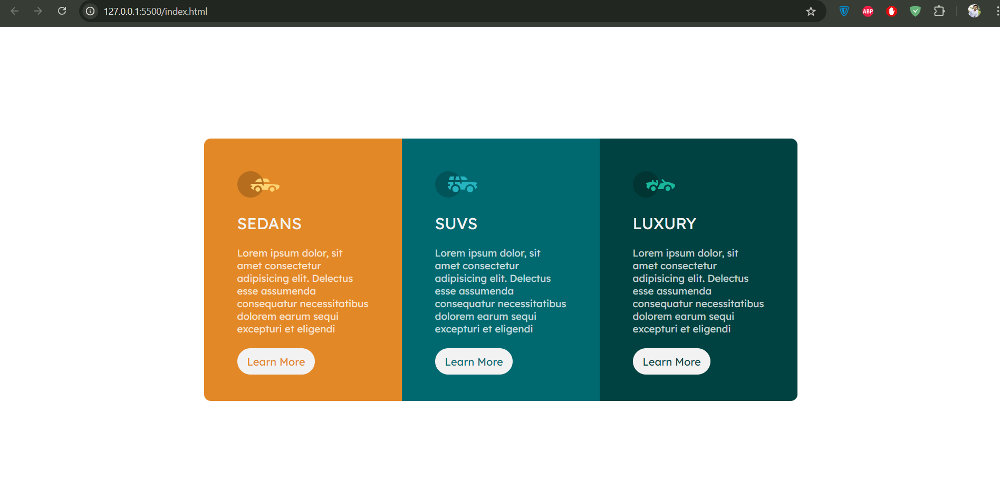

# Frontend Mentor - 3-column preview card component solution

This is my solution to the [3-column preview card component challenge on Frontend Mentor](https://www.frontendmentor.io/challenges/3column-preview-card-component-pH92eAR2-). Completing this challenge helped me improve my coding skills by working on a realistic front-end project.

## Table of contents

- [Overview](#overview)
  - [The challenge](#the-challenge)
  - [Screenshot](#screenshot)
  - [Links](#links)
- [My process](#my-process)
  - [Built with](#built-with)
  - [What I learned](#what-i-learned)
  - [Continued development](#continued-development)
  - [Useful resources](#useful-resources)
- [Author](#author)
- [Acknowledgments](#acknowledgments)

## Overview

### The challenge

Users should be able to:

- View the optimal layout depending on their device's screen size
- See hover states for interactive elements

### Screenshot



### Links

- **Solution URL:** [Add your solution URL here](https://github.com/MinhajSiam/3-column-preview-card-component)
- **Live Site URL:** [Add your live site URL here](https://minhajsiam.github.io/3-column-preview-card-component)

## My process

### Built with

- Semantic HTML5 markup
- CSS custom properties
- **Flexbox**
- Mobile-first workflow

### What I learned

I focused on using **Flexbox** for this project to create a responsive and flexible layout. Flexbox made it easier to manage the alignment and spacing of the columns. Here's a snippet of my Flexbox implementation:

```css
main {
            height: 100vh;
            display: flex;
            justify-content: center;
            align-items: center;
        }


        .sedans {
            flex: 1;
        }

        .suvs {
            flex: 1;
        }

        .luxury {
            flex: 1;
        }
```

This helped me create a flexible 3-column layout that adapts well to different screen sizes.

### Continued development

I want to continue honing my skills with Flexbox and work more on responsive design techniques. I also plan to explore using **CSS Grid** for more complex layouts in future projects.

### Useful resources

- [CSS Tricks Flexbox Guide](https://css-tricks.com/snippets/css/a-guide-to-flexbox/) - This guide was extremely helpful in understanding how Flexbox properties work and how to apply them to create responsive layouts.
- [MDN Web Docs - Flexbox](https://developer.mozilla.org/en-US/docs/Web/CSS/CSS_Flexible_Box_Layout) - I referred to this resource often to clarify Flexbox concepts and ensure correct usage.

## Author

- Frontend Mentor - [@MinhajSiam](https://www.frontendmentor.io/profile/MinhajSiam)
- Twitter - [@MinhajSiam](https://github.com/MinhajSiam)

## Acknowledgments

Thanks to Frontend Mentor for the challenge and to the community for the support and inspiration!